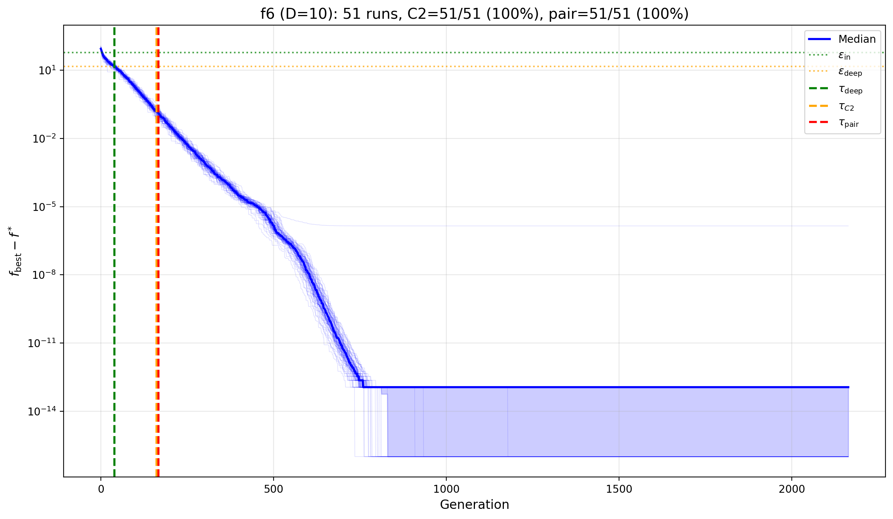
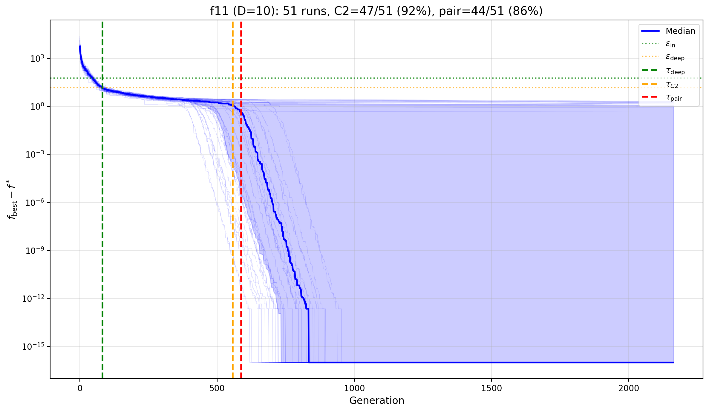
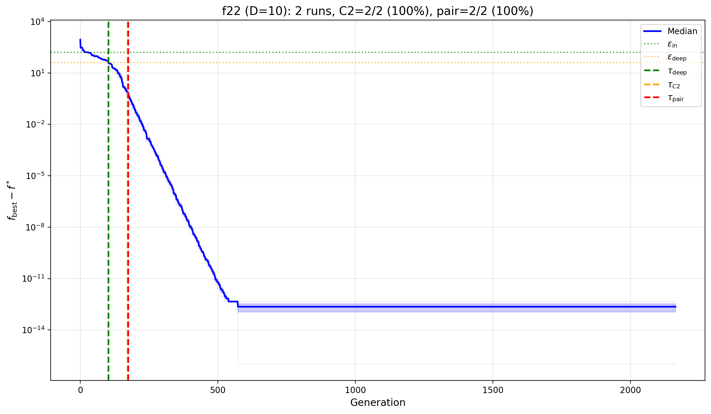
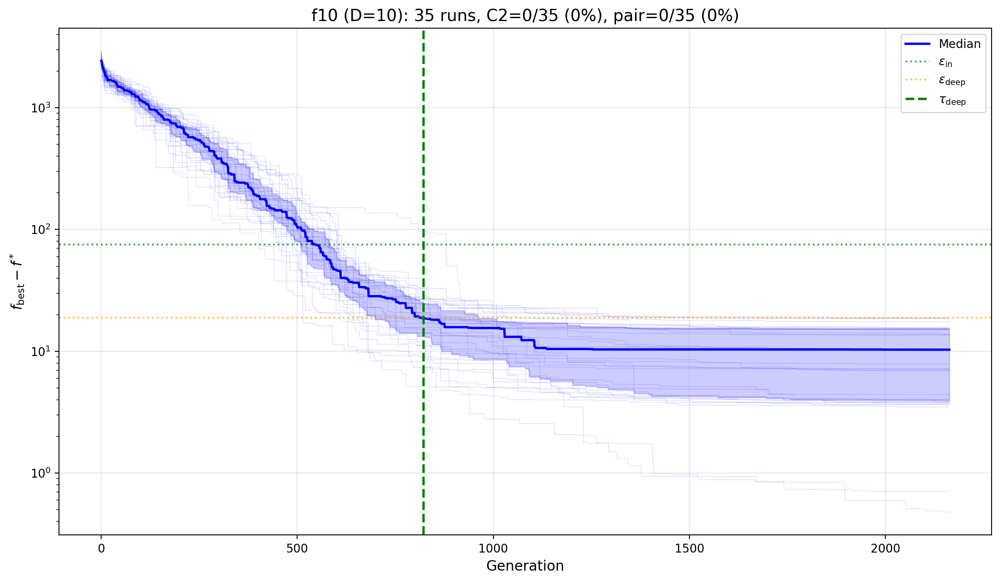

# Quasi-Morse Validation Results

Empirical validation of the Morse-function hazard bound (Theorem 5) on CEC2017, tracking three critical times: **τ_deep** (witness enters deep region), **τ_C2** (first concentrated neighbor), and **τ_pair** (≥2 concentrated neighbors, bound non-vacuous).

## Why "Quasi-Morse"?

CEC2017 functions are not true Morse functions—they may have degenerate critical points, flat regions, or numerical discontinuities. We apply the theoretical framework empirically, checking whether geometric concentration conditions (C1, C2) are satisfied *without* assuming strict C² smoothness. The term "quasi-Morse" denotes this empirical validation regime.

## Representative Convergence Plots

### Positive Examples

| f6 (D=10): 100% pair | f11 (D=10): 86% pair |
|:---:|:---:|
|  |  |

| f22 (D=10): 100% pair (2 runs) | |
|:---:|:---:|
|  | |

### Counter-Example: Concentration Failure

| f10 (D=10): 0% pair |
|:---:|
|  |

**f10** hits τ_deep in 35/51 runs but *never* achieves τ_C2 or τ_pair. The minimum neighbor distance (~80) far exceeds r_conc (~0.18), showing concentration failure despite reaching the deep region.

---

## Results by Dimension

All experiments use **margin = 60** (fixed across dimensions) to expose scaling difficulties.

### D = 10

| func | n | τ_deep | C2% | pair% | τ_pair | ĉ_pair |
|------|--:|-------:|----:|------:|-------:|-------:|
| f1 | 51 | 183 | 100 | 100 | 249 | 4.2×10⁻⁵ |
| f2 | 51 | 103 | 100 | 100 | 172 | 3.3×10⁻⁵ |
| f3 | 51 | 98 | 100 | 100 | 153 | 3.2×10⁻⁵ |
| f4 | 51 | 38 | 100 | 100 | 166 | 3.1×10⁻⁵ |
| f5 | 51 | 220 | 0 | 0 | — | — |
| f6 | 51 | 39 | 100 | 100 | 167 | 3.2×10⁻⁵ |
| f7 | 51 | 358 | 2 | 0 | — | — |
| f8 | 51 | 225 | 4 | 2 | 507† | 1.0×10⁻⁴ |
| f9 | 51 | 72 | 100 | 100 | 144 | 3.0×10⁻⁵ |
| f10 | 35 | 822 | 0 | 0 | — | — |
| f11 | 51 | 82 | 92 | 86 | 588 | 1.8×10⁻⁴ |
| f12 | 30 | 343 | 100 | 100 | 642 | 1.7×10⁻⁴ |
| f13 | 51 | 178 | 90 | 88 | 832 | 3.4×10⁻⁴ |
| f14 | 50 | 291 | 36 | 36 | 844 | 3.6×10⁻⁴ |
| f15 | 51 | 107 | 80 | 75 | 922 | 7.0×10⁻⁴ |
| f16 | 51 | 196 | 4 | 2 | 1235† | 1.5×10⁻³ |
| f17 | 51 | 395 | 0 | 0 | — | — |
| f18 | 50 | 207 | 90 | 88 | 705 | 2.3×10⁻⁴ |
| f19 | 51 | 92 | 20 | 6 | 1179† | 1.5×10⁻³ |
| f20 | 51 | 307 | 100 | 100 | 809 | 3.1×10⁻⁴ |
| f22† | 2 | 102 | 100 | 100 | 175 | 3.2×10⁻⁵ |
| f24† | 3 | 182 | 100 | 100 | 271 | 4.6×10⁻⁵ |

† Fewer than 10 valid runs (interpret with caution)

**Missing (no τ_deep):** f21, f23, f25–f30

---

### D = 30

| func | n | τ_deep | C2% | pair% | τ_pair | ĉ_pair |
|------|--:|-------:|----:|------:|-------:|-------:|
| f1 | 51 | 273 | 100 | 100 | 317 | 6.0×10⁻⁶ |
| f2 | 51 | 253 | 100 | 100 | 377 | 8.5×10⁻⁶ |
| f3 | 51 | 165 | 100 | 100 | 274 | 1.5×10⁻⁵ |
| f5 | 51 | 1148 | 2 | 0 | — | — |
| f6 | 51 | 66 | 100 | 100 | 166 | 1.1×10⁻⁵ |
| f8 | 51 | 1172 | 0 | 0 | — | — |
| f9 | 51 | 95 | 100 | 100 | 150 | 9.9×10⁻⁶ |
| f11 | 28 | 489 | 64 | 57 | 630 | 2.1×10⁻⁵ |
| f13 | 23 | 854 | 100 | 83 | 2276 | 8.3×10⁻³ |
| f14† | 4 | 1167 | 25 | 25 | 1768 | 1.1×10⁻³ |
| f15 | 51 | 560 | 98 | 92 | 2484 | 2.0×10⁻² |
| f16† | 10 | 2338 | 0 | 0 | — | — |
| f17† | 3 | 2054 | 0 | 0 | — | — |
| f18† | 4 | 1398 | 100 | 100 | 1600 | 6.5×10⁻⁴ |
| f19 | 51 | 746 | 98 | 86 | 2157 | 5.3×10⁻³ |
| f20† | 1 | 2547 | 0 | 0 | — | — |

† Fewer than 10 valid runs

**Missing (no τ_deep):** f4, f7, f10, f12, f21–f30

---

### D = 50

| func | n | τ_deep | C2% | pair% | τ_pair | ĉ_pair |
|------|--:|-------:|----:|------:|-------:|-------:|
| f1 | 51 | 389 | 100 | 100 | 434 | 3.3×10⁻⁶ |
| f2 | 51 | 577 | 100 | 100 | 759 | 1.3×10⁻⁵ |
| f3 | 51 | 212 | 100 | 100 | 363 | 7.8×10⁻⁶ |
| f4 | 23 | 991 | 100 | 100 | 1155 | 1.5×10⁻⁴ |
| f5 | 51 | 1984 | 0 | 0 | — | — |
| f6 | 51 | 67 | 100 | 100 | 160 | 3.7×10⁻⁶ |
| f8 | 51 | 2027 | 0 | 0 | — | — |
| f9 | 51 | 99 | 100 | 100 | 147 | 3.5×10⁻⁶ |
| f13† | 2 | 1626 | 50 | 50 | 2562 | 8.3×10⁻² |
| f18† | 1 | 1319 | 100 | 100 | 1598 | 2.2×10⁻⁴ |
| f19† | 3 | 707 | 100 | 100 | 2609 | 1.1×10⁻² |
| f22 | 14 | 1186 | 36 | 36 | 327 | 8.7×10⁻⁵ |

† Fewer than 10 valid runs

**Missing (no τ_deep):** f7, f10–f12, f14–f17, f20–f21, f23–f30

---

## Dimension Scaling Summary

Pair achievement rate (%) for functions with ≥20 runs across all tested dimensions:

| func | D=10 | D=30 | D=50 | Trend |
|------|-----:|-----:|-----:|:------|
| f1 | 100 | 100 | 100 | stable |
| f2 | 100 | 100 | 100 | stable |
| f3 | 100 | 100 | 100 | stable |
| f5 | 0 | 0 | 0 | fails |
| f6 | 100 | 100 | 100 | stable |
| f8 | 2 | 0 | 0 | fails |
| f9 | 100 | 100 | 100 | stable |
| f11 | 86 | 57 | — | degrades |
| f15 | 75 | 92 | — | (lost at D=50) |
| f19 | 6 | 86 | — | variable |

**Key finding:** Unimodal/simple functions (f1–f4, f6, f9) maintain 100% pair achievement across dimensions. Multimodal functions (f5, f8, f10, f17) consistently fail. Complex functions (f11, f15, f19) show degradation or disappear from validation as dimension increases.

---

## Reproducibility

```bash
python validate_quasi_morse.py --dim 10 --func all --base experiments \
  --outdir results/quasi_morse_validation/d10 --margin 60 --plots
```

Repeat with `--dim 30` and `--dim 50`.

---

## Column Definitions

| Column | Description |
|--------|-------------|
| n | Number of runs hitting τ_deep |
| τ_deep | Median generation entering A_{ε/4} |
| C2% | Fraction achieving τ_C2 (≥1 neighbor in r_conc) |
| pair% | Fraction achieving τ_pair (≥2 neighbors in r_conc) |
| τ_pair | Median generation when pair achieved |
| ĉ_pair | Median lower bound on c_pair at τ_pair |