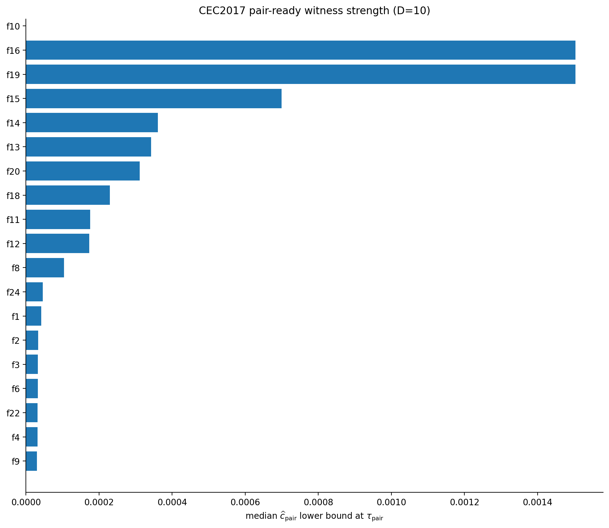
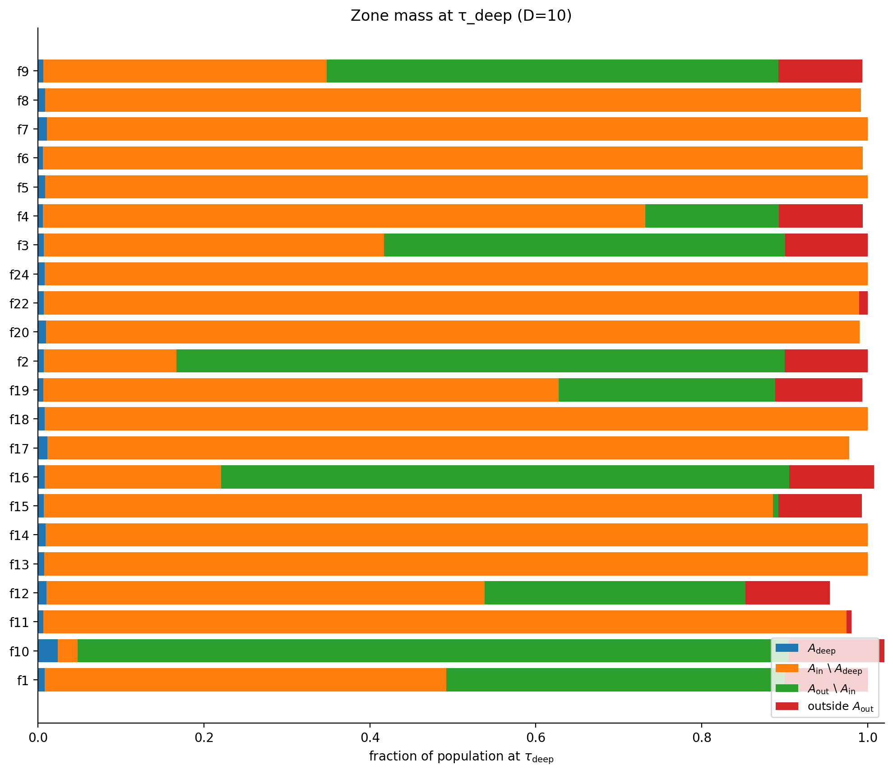

# Quasi-Morse Validation: D=10 Results

Concentration analysis for CEC2017 benchmark functions (dimension 10).

## Key Finding: Three Concentration Regimes

The convergence curves reveal that **τ_deep (entering basin) ≠ τ_pair (exploitation ready)**:

| Regime | Example | Gap | Interpretation |
|--------|---------|-----|----------------|
| **Fast** | f1 (unimodal) | ~65 gen | Quick concentration after discovery |
| **Dispersion** | f5 (multimodal) | ∞ | Population never concentrates |
| **Plateau** | f11 (hybrid) | ~500 gen | Long stagnation, then rapid collapse |

## Comprehensive Overview

## Individual Function Examples

### f1: Bent Cigar (Unimodal, Ill-Conditioned)

### f11: Hybrid Function 1 (Long Plateau)

### f5: Rastrigin (Multimodal — Dispersion)

## Summary Statistics

### Concentration Achievement by Function Class

| Class | Functions | C2 Achieved | Pair Achieved | Median Gap |
|-------|-----------|-------------|---------------|------------|
| Unimodal | f1–f4, f6 | 100% | 100% | 55–128 |
| Shifted/Rotated | f9 | 100% | 100% | 72 |
| Multimodal | f5, f7, f10, f17 | 0–2% | 0% | — |
| Hybrid | f11–f20 | 36–100% | 36–100% | 270–813 |
| Composition | f22, f24 | 100%* | 100%* | 72–89 |

*Only 4–6% of runs find the basin; those that do achieve full concentration.

### Critical Times and Hazard Bound

| Function | τ_deep | τ_C2 | τ_pair | c_pair | ã |
|----------|--------|------|--------|--------|---|
| f1 | 183 | 228 | 249 | 4.2×10⁻⁵ | 6.7×10⁻⁸ |
| f2 | 103 | 161 | 172 | 3.3×10⁻⁵ | 5.3×10⁻⁸ |
| f3 | 98 | 150 | 153 | 3.2×10⁻⁵ | 5.2×10⁻⁸ |
| f4 | 38 | 155 | 166 | 3.1×10⁻⁵ | 5.0×10⁻⁸ |
| f5 | 220 | — | — | — | — |
| f6 | 39 | 161 | 167 | 3.2×10⁻⁵ | 5.2×10⁻⁸ |
| f9 | 72 | 142 | 144 | 3.0×10⁻⁵ | 4.8×10⁻⁸ |
| f11 | 82 | 557 | 588 | 1.8×10⁻⁴ | 2.8×10⁻⁷ |
| f12 | 343 | 637 | 642 | 1.7×10⁻⁴ | 2.8×10⁻⁷ |
| f22 | 102 | 172 | 174 | 3.2×10⁻⁵ | 5.1×10⁻⁸ |

## Concentration Diagnostics

### c_pair Lower Bound at τ_pair

### Zone Mass Distribution at τ_deep

## Data Files

| File | Description |
|------|-------------|
| [morse_validate_D10_all.per_run.csv](morse_validate_D10_all.per_run.csv) | Per-run results (51 runs × 30 functions) |
| [morse_validate_D10_all.summary.csv](morse_validate_D10_all.summary.csv) | Summary statistics per function |

## Parameters Used

| Parameter | Value |
|-----------|-------|
| margin | 60 |
| deep_ratio | 0.25 |
| F⁻ | 0.1 |
| ΔF | 0.8 |
| L_n_dirs | 64 |
| L_quantile | 0.90 |

## Legend

- **τ_deep** (green): Witness enters basin (C1 satisfied)
- **τ_C2** (orange): First neighbor within r_conc (C2 satisfied)  
- **τ_pair** (red): Second neighbor within r_conc (c_pair > 0)
- **ε_in** (green dotted): Inner tolerance threshold
- **ε_deep** (orange dotted): Deep tolerance (0.25 × ε_in)